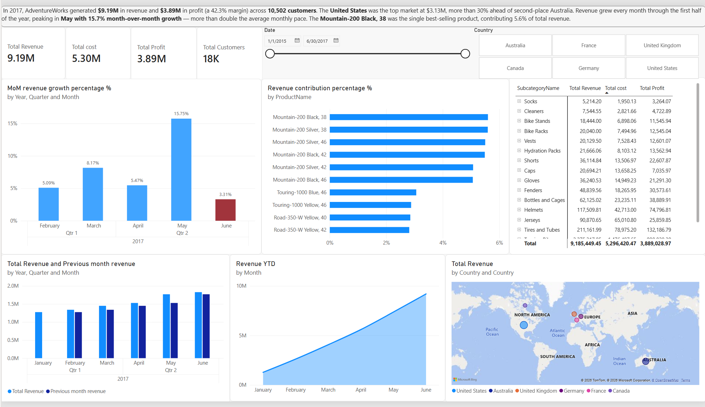
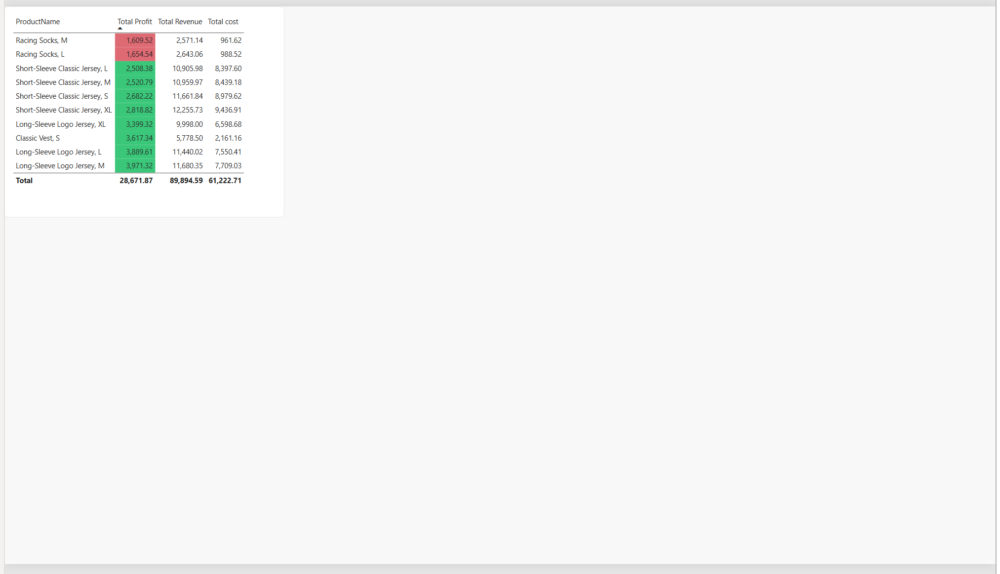

# AdventureWorks 2017 Sales Performance Dashboard

An interactive Power BI dashboard analyzing 2017 sales performance for AdventureWorks, a fictional multinational bike manufacturer. Built to practice end-to-end BI workflow: data modeling, DAX measures, and dashboard design aimed at surfacing business insights rather than just displaying numbers.

## Business Question

How did AdventureWorks perform in 2017 across revenue, profit, and customer growth — and which products and regions are driving (or dragging on) performance?

## Dashboard Preview

### Page 1 — Sales Performance Overview

### Page 2 — Underperforming Products

*(Add your exported PNG screenshots to a `screenshots/` folder using these file names, or update the paths above to match.)*

## Key Insights

- **Revenue & Profit:** Generated **$9.19M** in total revenue and **$3.89M** in profit (a 42.3% margin) across **10,502 customers**.
- **Top Market:** The **United States** led all countries at $3.13M in revenue — more than 30% ahead of second-place Australia ($2.41M).
- **Growth Trend:** Revenue grew every month from January through June 2017, peaking in **May at 15.7% month-over-month growth**, more than double the average monthly pace.
- **Top Product:** The **Mountain-200 Black, 38** was the single best-selling product, contributing 5.6% of total revenue on its own.
- **Product Deep Dive:** A dedicated second page isolates underperforming products by profit, using conditional formatting to flag the lowest-margin items at a glance.

## Features

- **4 KPI cards** — Total Revenue, Total Cost, Total Profit, Total Customers
- **Interactive slicers** — filter the entire page by date range and country
- **Area chart** — revenue trend by month
- **Geographic map** — revenue distribution by country
- **Clustered column charts** — revenue vs. previous month, and MoM growth % with conditional (red/green) formatting
- **Bar chart** — top products ranked by revenue contribution
- **Pivot table** — revenue, cost, and profit broken down by subcategory and product
- **Second page** — a table of products sorted by profit, with conditional formatting highlighting the lowest performers

## Data Model

Built on the standard AdventureWorks sample dataset:

| Table | Description |
|---|---|
| `AdventureWorks_Sales_2017` | Fact table — order-level transactions for 2017 |
| `AdventureWorks_Products` | Product catalog, cost, and price |
| `AdventureWorks_Product_Subcategories` | Product category hierarchy |
| `AdventureWorks_Customers` | Customer demographics |
| `AdventureWorks_Territories` | Sales region/country mapping |
| `AdventureWorks_Calendar` | Date dimension for time intelligence |

## Tools & Skills Used

- **Power BI Desktop** — data modeling, DAX, report design
- **DAX** — custom measures (Total Revenue, Total Profit, MoM Growth %, Previous Month Revenue)
- **Data modeling** — star schema with fact/dimension relationships
- **Data visualization & storytelling** — chart selection, conditional formatting, and layout designed around a clear business narrative rather than default chart types

## Files

- `Project.pbix` — the full Power BI file (download and open in Power BI Desktop to explore interactively)
- `screenshots/` — static previews of both dashboard pages

## About

Built by Akkash as a portfolio project for data/business analyst internship applications.
